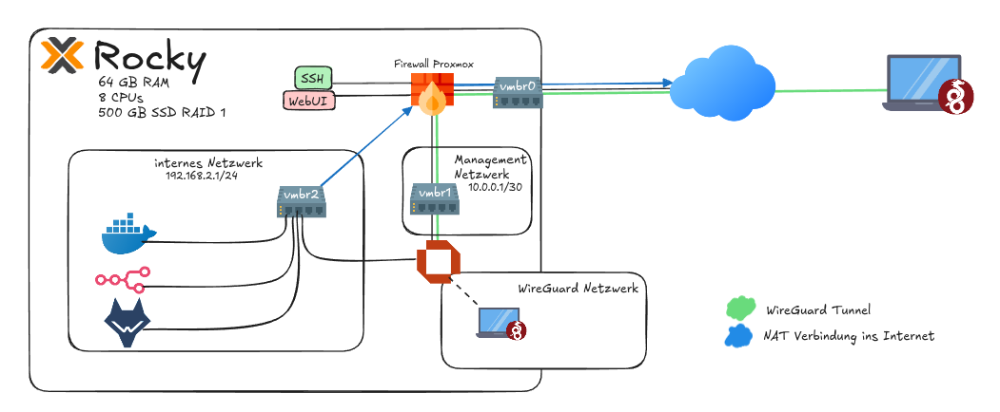
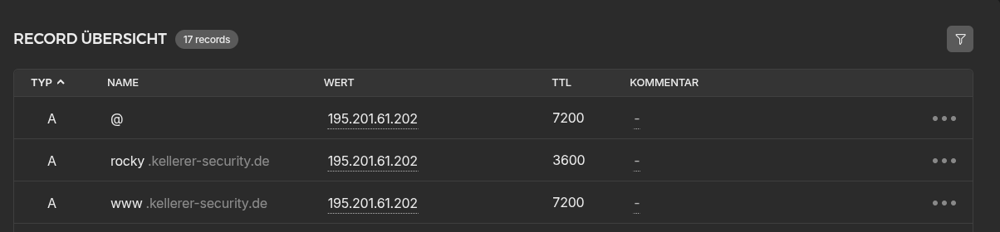
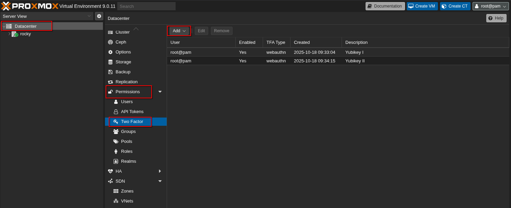
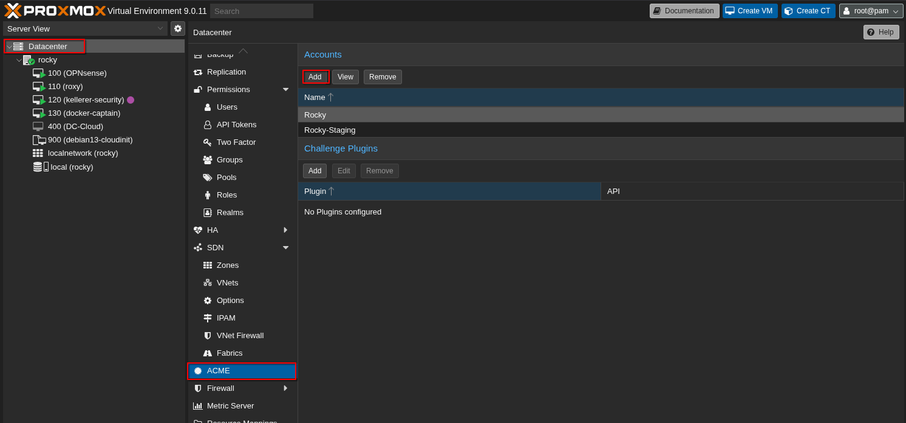
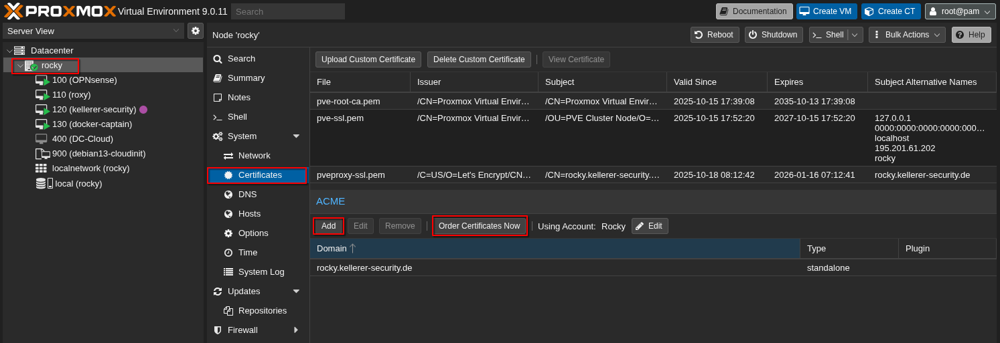
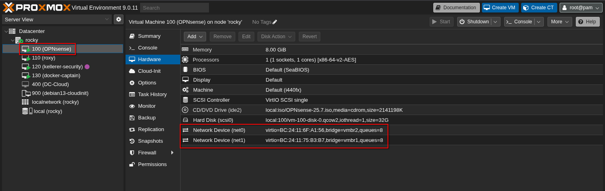

Einrichtung eines dedizierten Cloud-Servers mit Proxmox; Konfiguration eines internen und eines Management-Netzwerks mittels OPNsense Firewall, sowie einer sicheren Verbindung in die Netzwerke mittels Wireguard VPN

===

## Zielsetzung
Ziel ist eine Proxmox Instanz auf einem dedizierten Cloud-Server über eine eigene Domäne erreichbar zu machen und sicher zu betreiben.

Die Topologie sieht in etwa so aus:



## Vorbereitung: Proxmox Installation
Es gibt eine Vielzahl von Hostinganbietern und Domainregistrare, mit einer Reihe von Vor- und Nachteilen. Die Entscheidung für welchen man sich entscheidet ist hochgradig individuell, wesegen ich auf diesen Teil nur relativ oberflächlich eingehe.

Für mein Setup habe ich bei dem deutschen Hosting-Anbieter Hetzner einen dedizierten AX42 Server mit 64GB RAM und acht Kernen, sowie eine .de Domäne gemietet.

Ich habe mich dafür entschieden, Proxmox auf einem bestehenden Debian 13 (Trixie) zu installieren. Die offizielle Anleitung von Proxmox findet sich [hier](https://pve.proxmox.com/wiki/Install_Proxmox_VE_on_Debian_13_Trixie).

Hetzner erlaubt mir, das Betriebssystem für meinen Server aus einer Palette von Linux Varianten zu wählen und ermöglicht mir nach der Installation den Zugang über SSH.

Da unser Server über das Internet erreichbar ist, habe ich als Erstes einen SSH-Schlüssel hinterlegt und die Anmeldung mittels Passwort deaktiviert. 

!! Wichtig: Den SSH-Schlüssel vor der Deaktivierung testen, um ein Aussprerren zu vermeiden

!!! Ich ändere zusätzlich den Port des SSH-Dienstes auf einen unbekannten High-Port. Keine wirkliche Security-Maßnahme (Stichwort Security by Obscurity), hilft aber dennoch automatisierte Zugriffe auf den SSH-Service zu reduzieren.

Mit dem adäquat abgesicherten SSH-Zugang habe ich zuerst ein neues Passwort für den root-Zugang gesetzt (Passwortmanager!) und danach Proxmox relativ einfach installiert (Link siehe oben).

## Proxmox in der Cloud
Proxmox ist also auf unserem dedizierten Server installiert - Good Job!

Damit der Server auch zugleich unter unserer neuen Domäne erreichbar ist, muss ein passender A-Record im DNS angelegt werden. Es dauert einige Stunden, bis der Eintrag über das DNS hinweg synchronisiert und verfügbar ist, also genau arbeiten und etwas Geduld mitbringen.
In der Hetzner Konsole sieht das beispielsweise so aus:



Wenn alles geklappt hat, solltet ihr euren neuen Proxmox unter `https://deine-domäne.de:8006` erreichen können.
Die Zertifikatsmeldung ist zu erwarten. Prüft sicherheitshalber Zertifikat und Domain und akzeptiert dann die Warnung.
Sobald ihr weitergeleitet werdet, könnt ihr Euch mit dem zuvor gesetzten root-Passwort in der Proxmox-UI anmelden.

Um unser System weiter zu härten, habe ich zuerst einen zweiten Faktor für die Authentifizierung eingerichtet.

Die Option hierfür findet sich unter `Datacenter > Permissions > Two Factors`.



Als nächstes wollen wir passende Zertifikate erstellen, sodass im Browser keine Warnung mehr auftaucht, wenn wir unseren Server aufrufen.
Das kann ebenfalls komfortabel über das Webinterface von Proxmox erledigt werden.

Zuerst erstellen wir einen ACME Account über die GUI:



Wichtig ist, dass ihr bei `ACME Directory` "Let's Encrypt V2" auswählt.

Im nächsten Schritt wollt ihr unter `Servername > Certificates` den eben erstellten ACME Account hinzufügen und im Anschluss die Zertifikate erstellen lassen.



Wenn das geklappt hat, sollte jetzt auch die Zertifikatswarnung im Browser verschwunden sein.
## Grundlegende Netzwerkkonfiguration
Der wichtigste Teil ist getan und unser dedizierter Proxmox Server ist einsatzbereit. Spätestens hier bietet es sich an, zur leichteren Referenzierung einen Spitznamen zu vergeben ;)

Mein Server heißt _Rocky_.

Um nun unseren Server flexibel für verschiedenste Dinge nutzen zu können, müssen wir zuerst etwas die Netzwerkgrundlagen von Proxmox kennenlernen.
Das Fundament stellt die `/etc/network/interfaces` Datei dar. Viele Konfigurationen können auch über das Webinterface vorgenommen werden, die definitive Wahrheit findet sich aber letztendlich in `/etc/network/interfaces`.

Proxmox verwendet sogenannte _Linux Bridges_. Diese kann man sich mehr oder weniger wie einen virtuellen Switch vorstellen, an dem wir unsere VMs anschließen.

Mit der Standard Linux Bridge (vmbr0) verknüpfen wir unser physikalisches Interface, welches auch die statische IPv4-Adresse hat.

Außerdem erstellen wir zwei neue Bridges: eine für ein internes Managementnetz und eine für ein internes Standardnetz.
Zweck des Managementnetzes ist der Zugriff auf Schlüsselkomponenten, wie die zentrale Firewall. Im Standardnetzwerk betreiben wir unsere erste Test-VM.

Wir schauen uns Schritt für Schritt die Konfiguration der Bridges in der `/etc/network/interfaces` an.

Die einzige Bridge, welche eine Verbindung in das Internet aufbauen kann ist `vmbr0`. Die Werte von `address`, `gateway` und `bridge-ports` unterscheiden sich logischerweise bei Eurem Setup und spiegeln die Einstellungen meiner Proxmox Instanz wieder.

```
auto vmbr0
iface vmbr0 inet static
        address 195.201.61.202/26
        gateway 195.201.61.193
        bridge-ports enp6s0
        bridge-stp off
        bridge-fd 0
#route 195.201.61.192/26 via 195.201.61.193
```

Die beiden zusätzlichen Bridges `vmbr1` und `vmbr2` unterscheiden sich zunächst nur in der Netzwerkadresse (später werden wir für `vmbr2` zusätzlich NAT konfigurieren, sodass die VMs in diesem Netzwerk das Internet erreichen können). 

Für mein Managementnetzwerk wähle ich Netzwerk 10.0.0.1/30. Dies entspricht einem sehr kleinen Netz mit lediglich zwei verfügbaren IPv4 Adressen.

```
auto vmbr1
iface vmbr1 inet static
    address 10.0.0.1/30
    bridge-ports none
    bridge-stp off
    bridge-fd 0
```

Für mein internes Netzwerk definiere ich ein /24 Netzwerk mit dem Netzanteil `192.168.2`.

```
auto vmbr2
iface vmbr2 inet static
        address 192.168.2.0/24
        bridge-ports none
        bridge-stp off
        bridge-fd 0
```

Wenn das Thema Netzwerktechnik noch recht neu für Euch ist, empfehle ich an dieser Stelle das Ganze einmal mit Stift und Papier zu skizzieren und einige Grundlagen zu klären:
* Was ist der Netz- und was der Hostanteil?
* Welche Adressbereiche für private Netzwerke gibt es?
* In welchem Layer des OSI Modells funktionieren Switch bzw. Router?

Wir haben also erfolgreich zwei neue Netzwerke auf unserem Proxmox Host eingerichtet. Im nächsten Schritt werden wir die Kommunikation zwischen den Netzwerken mittels Firewallregeln definieren.

## Firewallkonfiguration
Für das Konfigurieren _der Firewall_ ist eine wichtige Unterscheidung notwendig.

Wir werden zum einen einige wenige Regeln direkt auf unserem Proxmox Host konfigurieren, der Großteil der Konfiguration findet allerdings auf einer eigens dafür eingesetzten OPNsense VM statt. 

### OPNsense Firewall
Nachdem die neueren Versionen von pfSense keine Offlineinstallation mehr anbieten, sah ich mich gezwungen zu OPNsense zu wechseln.
Mein erster Eindruck ist sehr positiv. Das Interface wirkt modern und übersichtlich und die Konfiguration war bisher einfach und unkompliziert.

Wir erstellen also auf unserem Proxmox eine OPNsense VM, welche die Rolle der zentralen Firewall einnimmt.

!! Achtung: um die Firewall zu konfigurieren, muss sie zeitweise vom Internet aus erreichbar sein! Setzt dafür, über die Konsole im Vorfeld ein starkes Passwort und aktiviert idealerweise auch MFA

Zunächst konfigurieren wir die OPnsense VM mit zwei Netzwerkinterfaces. Die VM ist somit mit `vmbr1` und `vmbr2` verbunden.



Im Webinterface der OPNsense habe ich dann für die Interfaces die IP Adressen `192.168.2.2` für das interne Netz und `10.0.1.2` für das Management-Netz vergeben.

Neuen VMs sollte die Adresse `192.168.2.2` als Standard-Gateway mitgegeben werden, sodass sich die Firewall korrekt um das Routing kümmern kann.

### Proxmox Firewall
Fehlt noch die Firewallkonfiguration auf unserem Proxmox Host.

Zu unserer `vmbr0` Bridge fügen wir folgende Regeln hinzu:

```
	post-up echo 1 > /proc/sys/net/ipv4/ip_forward
	post-up iptables -t nat -A PREROUTING -i vmbr0 -p tcp \
		-m multiport ! --dport 22,8006 -j DNAT --to 10.0.0.2
    post-up iptables -t nat -A PREROUTING -i vmbr0 -p udp \
	    -j DNAT --to 10.0.0.2
```

Dadurch leiten wir jeglichen Netzwerk, außer 22 (SSH) und 8006 (Webinterface) an das WAN Interface der OPNsense weiter. Zudem aktivieren wir IP-Forwarding.

Um den Maschinen im internen Netzwerk Internetzugang zu erlauben setzen wir noch eine entsprechende `MASQUERADE` Regel wie folgt:

```
	post-up   iptables -t nat -A POSTROUTING -s 192.168.2.0/24 \
		-o vmbr0 -j MASQUERADE
	post-down iptables -t nat -D POSTROUTING -s 192.168.2.0/24 \
		-o vmbr0 -j MASQUERADE
```

## WireGuard Tunnel
In der offiziellen OPNsense Dokumentation gibt es einen ausführlichen Artikel, um ein sogenanntes Road Warrior Setup zu konfigurieren. also eine zentrale WireGuard Instanz auf der OPNsense Firewall zu der sich andere Geräte wie Laptop oder Smartphone verbinden können, um eine sichere Verbindung in das interne Netzwerk herzustellen.

Die offizielle Dokumentation findet sich [hier](https://docs.opnsense.org/manual/how-tos/wireguard-client.html).

Grob zusammengefasst, werden folgende Schritte durchgeführt:
1. Über `VPN > Wireguard > Instanzen` eine neue WireGuard Instanz anlegen (ich habe dabei die Tunneladresse `10.0.1.1/24` gewählt)
2. Kryptografisches Schlüsselmaterial auf der OPNsense und dem entsprechenden Peer (in meinem Fall mein Laptop) erzeugen und austauschen
	* Auf jeder Maschine wird ein eigener **privater Schlüssel** erzeugt
	* Zudem wird der **öffentliche Schlüssel** des Gesprächspartners hinterlegt!
	* Im Anhang findet sich die Konfigurationsdatei meines Laptops
3. Abschließend müssen einige Interface und Firewall Einstellungen vorgenommen werden
	* Der WireGuard Instanz eigenes Interface zuweisen (nötig für Firewallregeln)
	* Mittels `Firewall > NAT > Outbound` entsprechende NAT Regeln hinzufügen, wenn andere Netze vom Wireguard Tunnel erreicht werden sollen
	* [Firewallregel] Eingehende Pakete auf Zielinterface der Wireguard Verbindung (momentan UDP 57020 via`vmbr0`) erlauben
	* [Firewallregel] Datenverkehr von Wireguard Interface in Zielnetze erlauben
	* ggfs. noch Normalisierungs-Regel konfigurieren (siehe Dokumentation)

Wenn alles richtig konfiguriert ist, solltet ihr auf Eurem Road Warrior Gerät (in meinem Fall mein Laptop) den Tunnel aufbauen können.

Unter Arch Linux verwende ich dazu folgendes Kommando: `sudo wg-quick up wg0`

Das wars! Der Grundstein ist gelegt, um ein absolut fabelhaftes Lab in der Cloud einzurichten.

Bis zum nächsten Mal.

## Anhang

Vollständige `/etc/network/interfaces` Datei auf Rocky (Proxmox Host)

```
# network interface settings; autogenerated
# Please do NOT modify this file directly, unless you know what
# you're doing.
#
# If you want to manage parts of the network configuration manually,
# please utilize the 'source' or 'source-directory' directives to do
# so.
# PVE will preserve these directives, but will NOT read its network
# configuration from sourced files, so do not attempt to move any of
# the PVE managed interfaces into external files!

source /etc/network/interfaces.d/*

auto lo
iface lo inet loopback

iface lo inet6 loopback

auto enp6s0
iface enp6s0 inet manual

auto vmbr0
iface vmbr0 inet static
	address 195.201.61.202/26
	gateway 195.201.61.193
	bridge-ports enp6s0
	bridge-stp off
	bridge-fd 0
	post-up echo 1 > /proc/sys/net/ipv4/ip_forward
	post-up iptables -t nat -A PREROUTING -i vmbr0 -p tcp -m multiport ! --dport 22,8006 -j DNAT --to 10.0.0.2
        post-up iptables -t nat -A PREROUTING -i vmbr0 -p udp -j DNAT --to 10.0.0.2
#route 195.201.61.192/26 via 195.201.61.193

iface vmbr0 inet6 static
	address 2a01:4f8:13b:44a::2/64
	gateway fe80::1

auto vmbr1
iface vmbr1 inet static
	address 10.0.0.1/30
	bridge-ports none
	bridge-stp off
	bridge-fd 0

auto vmbr2
iface vmbr2 inet static
	address 192.168.2.1/24
	bridge-ports none
	bridge-stp off
	bridge-fd 0
	post-up   iptables -t nat -A POSTROUTING -s 192.168.2.0/24 -o vmbr0 -j MASQUERADE
	post-down iptables -t nat -D POSTROUTING -s 192.168.2.0/24 -o vmbr0 -j MASQUERADE

```

WireGuard Konfigurationsdatei auf meinem Laptop

```
[Interface]
Address = 10.0.1.2/32
PrivateKey = xxxxxxxxxxxxxxxxxxxxxxxxxxxxxxxxxxxxxxxxxxx=
MTU = 1420

[Peer]
PublicKey = ksCL1IwZC5Je/PJoBVKcip9huQeKaNm4IKgQ59GZ0FE=
Endpoint = 195.201.61.202:57020
AllowedIPs = 192.168.2.1/24
PersistentKeepalive = 25
```
