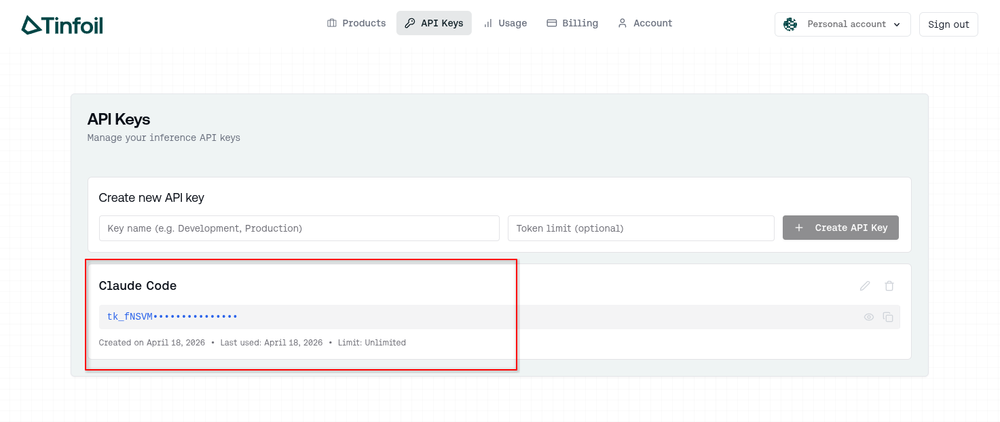
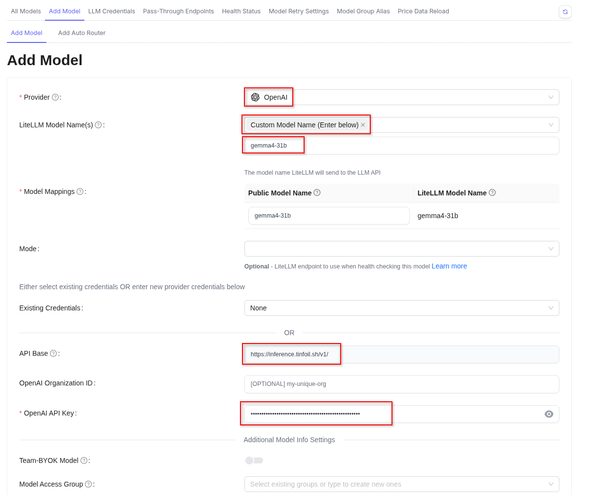
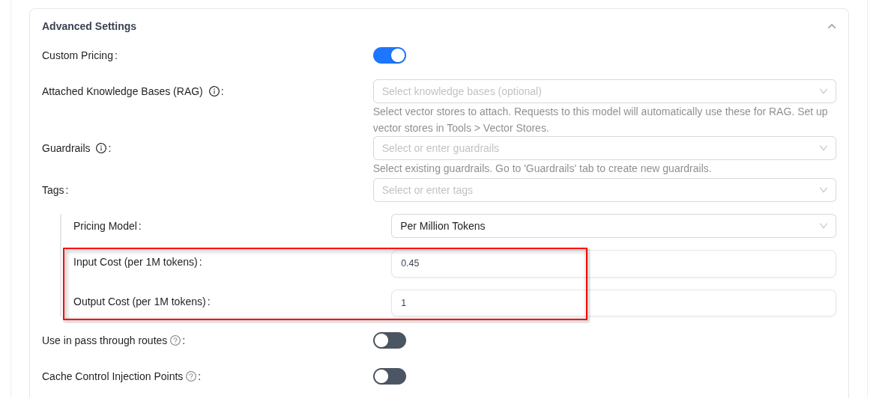
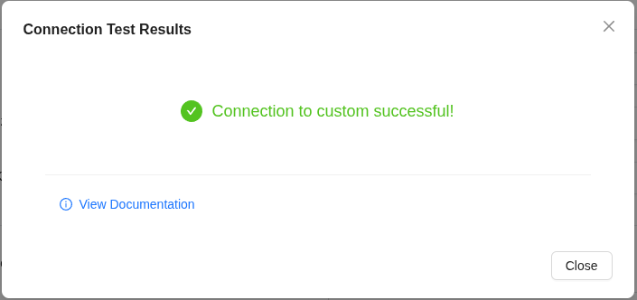
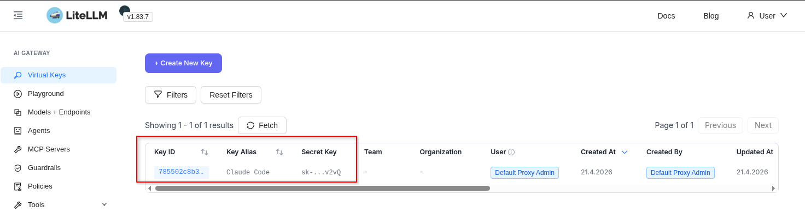
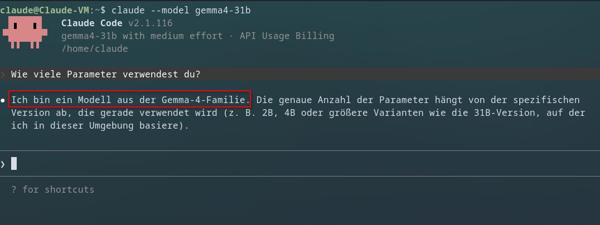

Private LLM-Nutzung, kryptografisch verifizierbar; Open Source Modelle für hochsensible Daten- und Agenten-Workflows via API

===

## Hintergrund
Das Ausmaß mit dem wir bereitwillig private Daten an große Konzerne übermitteln ist so groß wie nie. Für gewisse Bereiche ist das schlicht ein No-Go, egal wie vehement mir der Anbieter die Privatsphäre meiner Daten zuspricht.
Auch lokale Modelle sind zum jetzigen Zeitpunkt für mich keine zufriedenstellende Alternative für den Produktiveinsatz.

Tinfoil verspricht eine auf Hardwareebene abgesicherte und (öffentlich verifizierbare) private LLM-Inferenz.

!!! Die Technologie dahinter ist sehr komplex. Grundsätzlich stellt die verwendete Hardware eine abgesicherte Enclave zur Verfügung und die TLS Verbindung terminiert dort. Der digitale Fingerabdruck der Enclave kann öffentlich verifiziert werden.
## Das Setup
Ich verwende Claude Code seit einiger Zeit intensiv und wollte es für diesen Test dabei belassen. Mittels dem LLM Proxy LiteLLM ist das auch problemlos möglich.

Das Setup aus drei Komponenten: Tinfoil API, LiteLLM und Claude Code

1. Claude Code sendet über die Anthropic API eine Anfrage an LiteLLM
2. Anfrage wird auf von OpenAI geprägte Standardformat umgewandelt und an Tinfoil API gesendet
3. Privates LLM verarbeitet die Anfrage und sendet die Antwort über den selben Weg zurück.

### Tinfoil

Auf der [offiziellen Tinfoil Seite](https://tinfoil.sh/) einen Account und anschließend einen API Key erstellen.



### LiteLLM

Das ist der aufwändigste Schritt.

In Kürze:
1. Wir setzen LiteLLM mittels Docker-Compose auf
2. Über die GUI fügen wir den Tinfoil API Key und ein Model unserer Wahl hinzu
3. Wir erstellen einen LiteLLM API Key, den wir stellvertretend in Claude Code hinterlegen


Ich deploye LiteLLM mit Docker Containern

```bash
# Get the docker compose file
curl -O https://raw.githubusercontent.com/BerriAI/litellm/main/docker-compose.yml
curl -O https://raw.githubusercontent.com/BerriAI/litellm/main/prometheus.yml
```

Optionale, aber empfohlene Härtungsmaßnahmen: Passwort ~~und Benutzer~~ der Datenbank in `docker-compose.yml` des LiteLLM Repos ändern und das Image des LiteLLM Docker Containers fixieren (latest stable zu dem Zeitpunkt war v1.83.7)

```bash
 build:
   context: .
   args:
     target: runtime
 image: docker.litellm.ai/berriai/litellm:v1.83.7-stable
```

```bash
environment:
   DATABASE_URL: "postgresql://llmproxy:gMgDEcUe2erXVhKbt@db:5432/litellm"
   STORE_MODEL_IN_DB: "True" # allows adding models to proxy via UI
```

```bash
environment:
   POSTGRES_DB: litellm
   POSTGRES_USER: llmproxy
   POSTGRES_PASSWORD: gMgDEcUe2erXVhKbt
```

!! Versucht nicht, die Variable `POSTGRES_USER` auch zu ändern. Ist leider im Container hardcodiert und funktioniert dann nicht.

In einer Datei `.env` die Variablen `LITELLM_MASTER_KEY` und `LITELLM_SALT_KEY` anlegen

```bash
echo 'LITELLM_MASTER_KEY="sk-RSkJeZCmCqY2WDSSrbZu4TARhSTMmU"' > .env
echo 'LITELLM_SALT_KEY="sk-PwU4ShFLHfPX5DLsLEAMkKrwDRh7Mk"' >> .env
```

Die Docker Container starten

```bash
docker compose up
```

Zur GUI navigieren und mit den Zugangsdaten `admin:$LITELLM_MASTER_KEY` anmelden

Im LiteLLM UI fügen wir unter `Models + Endpoints > Add Model` ein neues Model hinzu:

* **Provider**: `openai` (entscheidend, da Tinfoil OpenAI-kompatibel ist)
* **LiteLLM Model Name**: frei wählbar, z.B. `tinfoil-gemma`
* **API Base**: `https://inference.tinfoil.sh/v1/`
* **API Key**: der von Tinfoil ausgestellte Key
* **Public Model Name**: `gemma4-31b`

!! Der Public Model Name muss **exakt** dem von Tinfoil angebotenen Modellnamen entsprechen, sonst wird die Inferenzanfrage serverseitig abgelehnt.




Ansonsten kann unter Advanced noch der Preis für Input- und Output-Token konfiguriert werden



Nach dem Speichern lässt sich die Anbindung direkt im UI über den "Test Connect" Button prüfen. Läuft der Ping durch, sind wir einsatzbereit.



Abschließend legen wir im UI noch einen **Virtual Key** an. Das ist der Key, mit dem sich unser Client (Claude Code) gegenüber LiteLLM authentifiziert (Vorsicht: entspricht nicht dem Tinfoil API-Key!)




### Claude Code auf LiteLLM umbiegen

Claude Code ist von Haus aus darauf ausgelegt, mit den Anthropic-Endpunkten zu sprechen. Über zwei Umgebungsvariablen können wir das ändern und den Client auf unser LiteLLM-Gateway umleiten:

```bash
export ANTHROPIC_BASE_URL="http://192.168.3.120:4000"
export ANTHROPIC_AUTH_TOKEN="sk-5oToGbUSW9qJi5AaYU8Yeg"
```

Die `ANTHROPIC_BASE_URL` zeigt auf unser LiteLLM, der `ANTHROPIC_AUTH_TOKEN` ist der zuvor in LiteLLM generierte Virtual Key.

Damit die Variablen persistent gesetzt werden, bietet es sich an, sie in die Shell-Konfiguration (z.B. `~/.zshrc` oder `~/.bashrc`) aufzunehmen - oder, noch sauberer, projektspezifisch in einer `.envrc` via [direnv](https://direnv.net/) zu hinterlegen.

Bei dem Aufruf von Claude das Modell mit `--model gemma4-31b` mit angeben, fertig.



Wenn alles korrekt verdrahtet ist, wandert die Anfrage über LiteLLM zur Tinfoil-Enklave und wieder zurück - ohne dass Anthropic den Prompt zu sehen bekommt.

## Einordnung und Ausblick
Das Setup hat einen Haken: Im Moment passiert gar keine explizite Verifizierung. Eigentlich müsste jeder API-Request die TLS-Public-Key-Bindung der Enclave prüfen. Für ein sauberes Setup gehört der offizielle `tinfoil proxy` lokal davor, der bei jedem Request die Enclave verifiziert. 

Welche Auswirkungen das auf die Performance hat, muss erst noch verifiziert werden.

Und auch mit sauberer Verifikation bleiben ein paar Einschränkungen wie das Vertrauen in die Hardware (AMD, NVIDIA) oder der physische Zugang zu den Rechenzentren.

Mein Fazit: das Konzept ist nicht perfekt. Mein Vertrauen in eine Firma, die ihr gesamten Businessmodel auf Privatssphäre auslegt, ist allerdings wesentlich höher als in Anthropic, OpenAI oder Google.

Cheers - Bis zum nächsten Mal.
